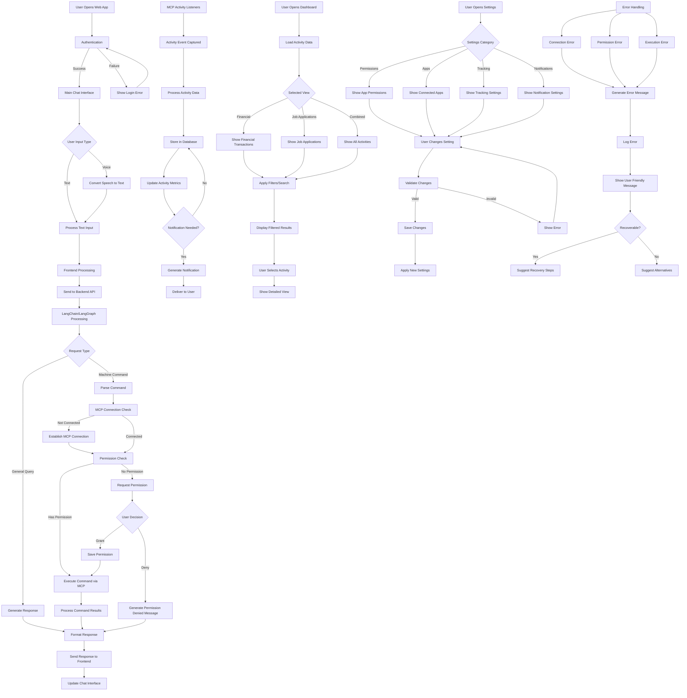
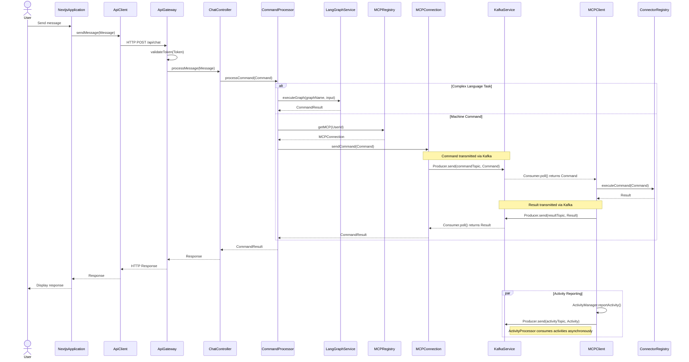

# High-Level Design (HLD)


## System Architecture Overview

### Core Components
1. **Frontend (Next.js + TypeScript)**
   - User Interface Layer
   - State Management 
   - Communication Layer

2. **Backend (FastAPI + Python)**
   - API Gateway
   - Authentication Service
   - Machine Context Protocol Integration
   - LangChain/LangGraph Processing Engine
   - Activity Tracking System
   - Notification Service
   - Data Storage Layer

3. **Machine Context Protocol Layer**
   - Command Execution Service
   - Permission Management
   - Application Connectors
   - Activity Listeners

### Data Flow Architecture
1. User interacts with the web interface (text/voice input)
2. Frontend packages the request and sends to backend API
3. Backend processes the request through LangChain/LangGraph
4. If local machine interaction is needed, requests pass through MCP layer
5. Results return through the same pipeline to the frontend
6. Activity data is continuously collected, processed and made available through the dashboard

## Key Features Detailed

### Chat Interface
- Real-time messaging system with typing indicators
- Support for text, voice, and rich media responses
- History retention and context awareness
- Message threading for complex interactions

### Machine Context Integration
- Secure connection to local machine
- Standardized command execution protocol
- Permission-based access control
- Application-specific connectors
- Activity monitoring

### Activity Dashboard
- Financial transaction tracking
- Job application monitoring
- Time-based activity visualization
- Filtering and search capabilities
- Detailed activity inspection

### Notification System
- Real-time alerts
- Customizable notification preferences
- Priority-based notification queuing
- Action-enabled notifications

# Low-Level Design (LLD)

## Frontend Architecture (Next.js + TypeScript)

### Component Structure
```
src/
├── app/                 # Next.js App Router
│   ├── api/             # API route handlers
│   ├── auth/            # Authentication pages
│   ├── chat/            # Chat interface
│   ├── dashboard/       # Activity dashboard
│   ├── settings/        # User settings
│   └── layout.tsx       # Root layout
├── components/
│   ├── chat/            # Chat-related components
│   │   ├── ChatContainer.tsx
│   │   ├── MessageBubble.tsx
│   │   ├── InputArea.tsx
│   │   ├── VoiceInput.tsx
│   │   └── CommandSuggestions.tsx
│   ├── dashboard/       # Dashboard components
│   │   ├── ActivityFeed.tsx
│   │   ├── FinancialTracking.tsx
│   │   ├── JobApplications.tsx
│   │   └── ActivityFilters.tsx
│   ├── notifications/   # Notification components
│   │   ├── NotificationCenter.tsx
│   │   ├── NotificationItem.tsx
│   │   └── NotificationBadge.tsx
│   ├── settings/        # Settings components
│   │   ├── PermissionsManager.tsx
│   │   ├── AppConnector.tsx
│   │   └── TrackingPreferences.tsx
│   └── ui/              # Shared UI components
├── lib/
│   ├── api/             # API client
│   ├── hooks/           # Custom React hooks
│   ├── mcp/             # Machine Context Protocol client
│   ├── store/           # State management
│   └── utils/           # Utility functions
└── types/               # TypeScript type definitions
```

### Key Interfaces

```typescript
// Message types
interface Message {
  id: string;
  content: string;
  type: 'text' | 'voice' | 'command' | 'system';
  sender: 'user' | 'assistant';
  timestamp: Date;
  status: 'sending' | 'sent' | 'delivered' | 'read' | 'error';
  metadata?: Record<string, any>;
}

// Activity tracking
interface Activity {
  id: string;
  type: 'financial' | 'job' | 'browser' | 'system' | 'other';
  timestamp: Date;
  application: string;
  description: string;
  details: Record<string, any>;
  tags: string[];
}

// Machine Context Protocol
interface MCPCommand {
  target: string;
  action: string;
  parameters: Record<string, any>;
  requiresPermission: boolean;
  timeout?: number;
}

interface MCPResponse {
  success: boolean;
  data?: any;
  error?: string;
  executionTime?: number;
}

// Permission settings
interface Permission {
  application: string;
  actions: string[];
  granted: boolean;
  expires?: Date;
}
```

### State Management

Using React Context and custom hooks for state management:

```typescript
// ChatContext.tsx
export const ChatContext = createContext<{
  messages: Message[];
  sendMessage: (content: string, type: string) => Promise<void>;
  isProcessing: boolean;
  clearHistory: () => void;
}>({
  messages: [],
  sendMessage: async () => {},
  isProcessing: false,
  clearHistory: () => {},
});

// useMCP.ts hook
export function useMCP() {
  const [isConnected, setIsConnected] = useState(false);
  const [permissionRequests, setPermissionRequests] = useState<Permission[]>([]);
  
  const executeCommand = async (command: MCPCommand): Promise<MCPResponse> => {
    // Implementation
  };
  
  return { isConnected, permissionRequests, executeCommand };
}
```

## Backend Architecture (FastAPI + Python)

### Directory Structure
```
backend/
├── app/
│   ├── api/               # API endpoints
│   │   ├── auth.py        # Authentication endpoints
│   │   ├── chat.py        # Chat endpoints
│   │   ├── activities.py  # Activity tracking endpoints
│   │   ├── mcp.py         # Machine Context Protocol endpoints
│   │   └── settings.py    # User settings endpoints
│   ├── core/
│   │   ├── config.py      # Application configuration
│   │   ├── security.py    # Security utilities
│   │   └── events.py      # Event handlers
│   ├── db/
│   │   ├── models.py      # Database models
│   │   ├── crud.py        # Database operations
│   │   └── session.py     # Database session management
│   ├── mcp/
│   │   ├── connector.py   # MCP connection handler
│   │   ├── commands.py    # Command definitions
│   │   ├── permissions.py # Permission management
│   │   └── listeners.py   # Activity listeners
│   ├── services/
│   │   ├── chat.py        # Chat processing service
│   │   ├── activities.py  # Activity tracking service
│   │   └── notifications.py # Notification service
│   ├── lang/
│   │   ├── chains.py      # LangChain components
│   │   ├── graphs.py      # LangGraph definitions
│   │   ├── prompts.py     # Prompt templates
│   │   └── agents.py      # Agent definitions
│   └── main.py            # Application entry point
├── alembic/               # Database migrations
├── tests/                 # Test suite
└── requirements.txt       # Dependencies
```

### API Endpoints

```python
# app/api/chat.py
from fastapi import APIRouter, Depends, HTTPException
from app.services.chat import ChatService
from app.core.security import get_current_user

router = APIRouter(prefix="/chat", tags=["chat"])

@router.post("/message")
async def process_message(
    message: ChatMessageCreate,
    current_user: User = Depends(get_current_user),
    chat_service: ChatService = Depends()
):
    """Process a new chat message and return response"""
    try:
        response = await chat_service.process_message(
            user_id=current_user.id,
            message=message.content,
            message_type=message.type
        )
        return response
    except Exception as e:
        raise HTTPException(status_code=500, detail=str(e))
```

### LangChain/LangGraph Integration

```python
# app/lang/graphs.py
from langgraph.graph import StateGraph
from langchain.chat_models import ChatOpenAI
from langchain.prompts import ChatPromptTemplate
from langchain.schema import StrOutputParser
from app.mcp.connector import MCPConnector

def create_chat_graph(mcp_connector: MCPConnector):
    # Define nodes
    llm = ChatOpenAI(temperature=0)
    
    # Command classifier node
    command_classifier_prompt = ChatPromptTemplate.from_template(
        """Determine if this is a general question or a machine command:
        {message}
        
        Output: [GENERAL] or [COMMAND]
        """
    )
    command_classifier = command_classifier_prompt | llm | StrOutputParser()
    
    # Command executor node
    def execute_command(state):
        command = state["parsed_command"]
        result = mcp_connector.execute(command)
        return {"execution_result": result}
    
    # Command parser node
    command_parser_prompt = ChatPromptTemplate.from_template(
        """Extract the command from this user message:
        {message}
        
        Target application: 
        Action:
        Parameters:
        """
    )
    command_parser = command_parser_prompt | llm | StrOutputParser()
    
    # Response generator node
    response_generator_prompt = ChatPromptTemplate.from_template(
        """Generate a helpful response based on the context:
        User message: {message}
        Command execution result: {execution_result}
        
        Response:
        """
    )
    response_generator = response_generator_prompt | llm | StrOutputParser()
    
    # Define graph
    workflow = StateGraph(input_keys=["message"])
    
    # Add nodes
    workflow.add_node("classifier", command_classifier)
    workflow.add_node("parser", command_parser)
    workflow.add_node("executor", execute_command)
    workflow.add_node("generator", response_generator)
    
    # Add edges
    workflow.add_conditional_edges(
        "classifier",
        {
            "[COMMAND]": "parser",
            "[GENERAL]": "generator"
        }
    )
    workflow.add_edge("parser", "executor")
    workflow.add_edge("executor", "generator")
    
    # Set entry and output
    workflow.set_entry_point("classifier")
    workflow.set_finish_point("generator")
    
    return workflow.compile()
```

### Machine Context Protocol Implementation

```python
# app/mcp/connector.py
from typing import Dict, Any, List
import asyncio
import websockets
import json
from app.db.models import Permission

class MCPConnector:
    def __init__(self, host: str = "localhost", port: int = 8765):
        self.host = host
        self.port = port
        self.connection = None
        self.active_listeners = {}
    
    async def connect(self):
        """Establish connection to the MCP service"""
        self.connection = await websockets.connect(f"ws://{self.host}:{self.port}")
        return self.connection
    
    async def execute(self, command: Dict[str, Any], user_id: str) -> Dict[str, Any]:
        """Execute a command through MCP"""
        # Check permissions
        has_permission = await self.check_permission(
            user_id=user_id,
            application=command["target"],
            action=command["action"]
        )
        
        if not has_permission:
            return {
                "success": False,
                "error": "Permission denied",
                "requires_permission": True
            }
        
        # Send command
        await self.connection.send(json.dumps({
            "type": "command",
            "data": command
        }))
        
        # Get response
        response = await self.connection.recv()
        return json.loads(response)
    
    async def register_listener(self, activity_type: str, callback):
        """Register a listener for specific activity types"""
        listener_id = f"{activity_type}_{id(callback)}"
        
        await self.connection.send(json.dumps({
            "type": "register_listener",
            "data": {"activity_type": activity_type}
        }))
        
        self.active_listeners[listener_id] = callback
        
        # Start listener loop
        asyncio.create_task(self._listener_loop(listener_id, activity_type))
        
        return listener_id
    
    async def _listener_loop(self, listener_id: str, activity_type: str):
        """Background task for handling activity events"""
        while listener_id in self.active_listeners:
            try:
                message = await self.connection.recv()
                data = json.loads(message)
                
                if data["type"] == "activity" and data["data"]["activity_type"] == activity_type:
                    callback = self.active_listeners[listener_id]
                    await callback(data["data"])
            except Exception as e:
                print(f"Listener error: {e}")
                await asyncio.sleep(1)
```

## Machine Context Protocol Specification

### Connection Protocol
1. Websocket-based connection on localhost:8765
2. JSON message format
3. Authentication via local token exchange

### Command Structure
```json
{
  "type": "command",
  "data": {
    "target": "browser",
    "action": "navigate",
    "parameters": {
      "url": "https://example.com"
    }
  }
}
```

### Activity Event Structure
```json
{
  "type": "activity",
  "data": {
    "activity_type": "financial",
    "timestamp": "2025-04-04T12:34:56Z",
    "application": "browser",
    "details": {
      "site": "amazon.com",
      "amount": 49.99,
      "category": "electronics"
    }
  }
}
```

### Permission Request Structure
```json
{
  "type": "permission_request",
  "data": {
    "target": "filesystem",
    "action": "read",
    "context": "The assistant is trying to access your documents folder",
    "one_time": false
  }
}
```

## Database Schema

```python
# app/db/models.py
from sqlalchemy import Column, String, DateTime, Boolean, JSON, ForeignKey
from sqlalchemy.ext.declarative import declarative_base
from sqlalchemy.orm import relationship
import datetime

Base = declarative_base()

class User(Base):
    __tablename__ = "users"
    
    id = Column(String, primary_key=True)
    email = Column(String, unique=True, index=True)
    name = Column(String)
    created_at = Column(DateTime, default=datetime.datetime.utcnow)
    
    chats = relationship("Chat", back_populates="user")
    permissions = relationship("Permission", back_populates="user")
    activities = relationship("Activity", back_populates="user")

class Chat(Base):
    __tablename__ = "chats"
    
    id = Column(String, primary_key=True)
    user_id = Column(String, ForeignKey("users.id"))
    title = Column(String)
    created_at = Column(DateTime, default=datetime.datetime.utcnow)
    updated_at = Column(DateTime, default=datetime.datetime.utcnow, onupdate=datetime.datetime.utcnow)
    
    user = relationship("User", back_populates="chats")
    messages = relationship("Message", back_populates="chat")

class Message(Base):
    __tablename__ = "messages"
    
    id = Column(String, primary_key=True)
    chat_id = Column(String, ForeignKey("chats.id"))
    content = Column(String)
    type = Column(String)  # text, voice, command, system
    sender = Column(String)  # user, assistant
    timestamp = Column(DateTime, default=datetime.datetime.utcnow)
    metadata = Column(JSON, nullable=True)
    
    chat = relationship("Chat", back_populates="messages")

class Permission(Base):
    __tablename__ = "permissions"
    
    id = Column(String, primary_key=True)
    user_id = Column(String, ForeignKey("users.id"))
    application = Column(String)
    action = Column(String)
    granted = Column(Boolean, default=False)
    created_at = Column(DateTime, default=datetime.datetime.utcnow)
    expires_at = Column(DateTime, nullable=True)
    
    user = relationship("User", back_populates="permissions")

class Activity(Base):
    __tablename__ = "activities"
    
    id = Column(String, primary_key=True)
    user_id = Column(String, ForeignKey("users.id"))
    type = Column(String)  # financial, job, browser, system, other
    timestamp = Column(DateTime)
    application = Column(String)
    description = Column(String)
    details = Column(JSON)
    
    user = relationship("User", back_populates="activities")
```

## System Flow



## Security Considerations

1. **Local Machine Security**
   - Strict permission model for accessing local resources
   - All machine commands require explicit user authorization
   - Time-limited permissions with expiration dates
   - Command audit logging

2. **Data Privacy**
   - Activity data stored locally by default
   - End-to-end encryption for all communications
   - Option to disable tracking for sensitive applications
   - Data retention policies with automatic cleanup

3. **Authentication**
   - Multi-factor authentication support
   - Session timeouts for inactive users
   - Permission revocation mechanisms
   - Limited retry attempts for failed authentications

## Deployment Architecture

For local deployment:
1. Frontend served through Next.js development server or production build
2. Backend running as FastAPI service
3. MCP running as a separate process with local websocket server
4. Local database (SQLite or PostgreSQL)

For production or shared deployment:
1. Frontend hosted on Vercel or similar platform
2. Backend deployed as containerized service (Docker)
3. MCP client deployed as desktop application with secure connection
4. Managed database service

## Implementation Plan

1. **Phase 1: Core Chat Interface**
   - Set up Next.js frontend with TypeScript
   - Implement basic chat UI components
   - Create FastAPI backend with LangChain integration
   - Establish basic authentication system

2. **Phase 2: Machine Context Protocol**
   - Develop MCP specification
   - Implement websocket-based connection
   - Create permission management system
   - Build basic command execution flow

3. **Phase 3: Activity Tracking**
   - Implement activity listeners
   - Create database models for activities
   - Develop activity dashboard UI
   - Build notification system

4. **Phase 4: Advanced Features**
   - Voice input processing
   - Enhanced visualization for activity data
   - User preferences and settings
   - Performance optimizations


# Machine Context Protocol Implementation with Advanced Tech


## Architecture with Advanced Technologies

### Core Technologies Added

1. **Apache Kafka**: For event streaming and reliable messaging between components
2. **Redis**: For caching, pub/sub capabilities, and session management
3. **gRPC**: For efficient, typed communication between MCP Client and backend
4. **Vector Database (e.g., Pinecone)**: For semantic search of past activities and commands
5. **Docker & Kubernetes**: For containerization and deployment
6. **WebRTC**: For direct peer-to-peer connections when needed

## Advanced Tech MCP

### 1. Kafka Integration

Kafka provides a robust event streaming platform that significantly improves the MCP implementation:

- **Command Queue**: Commands from backend to MCP Client flow through Kafka topics, ensuring delivery even if connections drop
- **Activity Streaming**: All user activities are streamed through Kafka, allowing multiple consumers (analytics, dashboard, notifications)
- **Event Sourcing**: Store all commands and activities as events, enabling replay and audit capabilities
- **Partition by User**: Each user gets a dedicated Kafka partition for their activities, improving scalability

### 2. Redis Enhancement

Redis provides fast in-memory operations for various MCP needs:

- **Permission Cache**: Cache user permissions for fast access
- **Command Results Cache**: Store recent command results to avoid redundant processing
- **Session Management**: Maintain user sessions and MCP connection states
- **Pub/Sub Channel**: Secondary communication path for urgent messages

### 3. MCP Client Communication Improvements

- **Primary gRPC Channel**: Typed, efficient communication for commands and responses
- **WebSocket Fallback**: For environments where gRPC might be blocked
- **WebRTC Direct Connection**: For high-bandwidth operations (file transfers, screen sharing)

```mermaid
flowchart TD
    subgraph "User's Machine"
        MCP["MCP Client"]
        FSC["Filesystem Connector"]
        BC["Browser Connector"]
        AC["Application Connectors"]
        AL["Activity Listeners"]
        LC["Local Cache (SQLite)"]
        
        MCP --- FSC & BC & AC
        MCP --- AL
        MCP --- LC
    end
    
    subgraph "Communication Layer"
        GRPC["gRPC Service"]
        WS["WebSocket Server"]
        WEBRTC["WebRTC Connection"]
        KAFKA["Kafka Cluster"]
        
        GRPC & WS & WEBRTC --- MCP
    end
    
    subgraph "Backend Infrastructure"
        API["API Gateway"]
        AUTH["Auth Service"]
        CMDP["Command Processor"]
        ACTP["Activity Processor"]
        PERMS["Permission Service"]
        NOTIF["Notification Service"]
        CACHE["Redis Cache"]
        
        API --- AUTH
        API --- CMDP & ACTP & PERMS
        CMDP & ACTP --- NOTIF
        CACHE --- CMDP & ACTP & PERMS & NOTIF
    end
    
    subgraph "Storage Layer"
        PGDB["PostgreSQL"]
        TSDB["TimescaleDB"]
        VDB["Vector DB"]
        BLOB["Blob Storage"]
        
        PGDB --- PERMS & API
        TSDB --- ACTP
        VDB --- CMDP & ACTP
        BLOB --- API
    end
    
    subgraph "AI Processing"
        LLM["LLM Service"]
        LC["LangChain"]
        LG["LangGraph"]
        
        LC --- LLM
        LG --- LC
        LG --- CMDP
    end
    
    KAFKA --- MCP
    KAFKA --- ACTP & CMDP
    GRPC & WS --- API
    WEBRTC --- API
    
    subgraph "Frontend"
        WEB["Web Application"]
        DASH["Dashboard"]
        
        WEB --- DASH
    end
    
    WEB --- API

```



## UML Class Diagram with Advanced Tech

```mermaid
classDiagram
    class MCPClient {
        -GRPCServer grpcServer
        -WebSocketServer wsServer
        -KafkaProducer kafkaProducer
        -KafkaConsumer kafkaConsumer
        -Map~string, ApplicationConnector~ connectors
        -Map~string, ActivityListener~ listeners
        -PermissionManager permManager
        -LocalCache cache
        +start()
        +stop()
        +executeCommand(Command) Response
        +registerListener(ActivityType, Callback)
        -handleKafkaMessages()
        -processCommand(Command)
    }
    
    class LocalCache {
        -SQLiteConnection connection
        +get(string key) any
        +set(string key, any value)
        +invalidate(string key)
        +clearExpired()
    }
    
    class KafkaProducer {
        -string bootstrapServers
        -string clientId
        +sendMessage(string topic, Message message)
        +flush()
        +close()
    }
    
    class KafkaConsumer {
        -string bootstrapServers
        -string groupId
        -List~string~ topics
        -MessageHandler handler
        +subscribe(List~string~ topics)
        +poll(Duration timeout)
        +commit()
        +close()
    }
    
    class ApplicationConnector {
        <<interface>>
        +executeAction(String, Parameters) Result
        +isAvailable() bool
        +getCapabilities() List~Capability~
    }
    
    class AdvancedFileSystemConnector {
        -WatchService fileWatcher
        +executeAction(String, Parameters) Result
        +isAvailable() bool
        +getCapabilities() List~Capability~
        -indexFiles(Directory)
        -setupFileWatchers()
        -handleFileChange(Path)
    }
    
    class BrowserExtensionConnector {
        -WebSocketClient extensionSocket
        +executeAction(String, Parameters) Result
        +isAvailable() bool
        +getCapabilities() List~Capability~
        -connectToExtension()
        -handleExtensionMessages()
    }
    
    class ActivityManager {
        -List~ActivityListener~ listeners
        -KafkaProducer producer
        -VectorDB vectorDB
        +registerListener(ActivityType, Callback)
        +unregisterListener(string listenerId)
        +reportActivity(Activity activity)
        +searchSimilarActivities(string query) List~Activity~
    }
    
    class DistributedPermissionManager {
        -RedisClient redisClient
        -PostgreSQLClient pgClient
        +checkPermission(UserId, Application, Action) bool
        +requestPermission(UserId, Application, Action) PermissionRequest
        +grantPermission(RequestId, bool)
        +revokePermission(PermissionId)
        -cachePermission(Permission)
        -invalidateCache(UserId, Application)
    }
    
    class BackendMCPConnector {
        -GRPCClient grpcClient
        -WebSocketClient wsClient
        -KafkaAdmin kafkaAdmin
        -KafkaProducer producer
        -KafkaConsumer consumer
        -ConnectionStatus status
        +connect() bool
        +disconnect()
        +executeCommand(Command) CommandFuture
        +streamCommands(CommandStream) ResponseStream
        +registerActivityCallback(ActivityType, Callback)
        -createUserTopics(UserId)
        -handleResponse(Response)
    }
    
    class CommandProcessor {
        -LangGraph langGraph
        -BackendMCPConnector mcpConnector
        -VectorDB commandHistoryDB
        -RedisCache resultsCache
        +processMessage(Message) ProcessingResult
        +cancelCommand(CommandId)
        -parseCommand(Message) Command
        -checkCache(Command) CachedResult
        -executeViaLangGraph(Command) ProcessedCommand
        -dispatchCommand(ProcessedCommand) CommandFuture
    }
    
    class ActivityProcessor {
        -KafkaConsumer consumer
        -TimescaleDB timescaleDB
        -VectorDB vectorDB
        -NotificationService notifService
        +processActivityStream()
        +queryActivities(Query) ActivityResult
        +generateInsights(UserId) Insights
        -vectorizeActivity(Activity) Vector
        -detectAnomalies(Activity) bool
        -triggerNotifications(Activity)
    }
    
    MCPClient *-- LocalCache
    MCPClient *-- KafkaProducer
    MCPClient *-- KafkaConsumer
    MCPClient *-- DistributedPermissionManager
    MCPClient o-- ApplicationConnector
    MCPClient *-- ActivityManager
    ApplicationConnector <|-- AdvancedFileSystemConnector
    ApplicationConnector <|-- BrowserExtensionConnector
    ActivityManager o-- KafkaProducer
    BackendMCPConnector *-- KafkaProducer
    BackendMCPConnector *-- KafkaConsumer
    CommandProcessor *-- BackendMCPConnector
    ActivityProcessor *-- KafkaConsumer

```



## Detailed Implementation Components

### 1. MCP Client Architecture

The MCP Client now operates as a sophisticated local agent with:

- **Multi-protocol Support**: gRPC (primary), WebSockets (fallback), and WebRTC (high-bandwidth operations)
- **Local Caching**: SQLite database for caching operations when offline
- **Kafka Integration**: Producers and consumers for reliable event streaming
- **Intelligent Command Routing**: Routes commands to appropriate application connectors
- **Smart Activity Detection**: Uses ML models to identify important activities
- **Extension System**: Pluggable architecture for adding new application connectors
- **Distributed Tracing**: OpenTelemetry integration for debugging and performance monitoring

### 2. Backend Services Architecture

The backend is now composed of specialized microservices:

- **API Gateway**: Routes requests to appropriate services
- **Command Processor**: Handles command parsing, validation, and execution
- **Activity Processor**: Processes and analyzes activity streams
- **Permission Service**: Manages user permissions with Redis caching
- **Notification Service**: Generates and delivers notifications
- **LLM Service**: Provides natural language processing capabilities

### 3. Data Storage Strategy

Multiple specialized databases for different data types:

- **PostgreSQL**: User data, permissions, and general structured data
- **TimescaleDB**: Time-series data for activities and metrics
- **Vector Database**: Semantic search for activities and command history
- **Redis**: Caching and real-time data
- **Kafka**: Event streaming and command/activity logs
- **Blob Storage**: Large files and binary data

### 4. Interaction Flow with Advanced Tech

1. **Command Flow**
   ```
   User → Web App → API Gateway → Command Processor → LangGraph →
   Command Processor → Kafka → MCP Client → Application Connector →
   Local Application → Results → MCP Client → Kafka →
   Command Processor → API Gateway → Web App → User
   ```

2. **Activity Tracking Flow**
   ```
   Local Activity → Activity Listener → MCP Client → Kafka →
   Activity Processor → TimescaleDB & Vector DB → 
   Notification Service (if needed) → API Gateway → Web App Dashboard
   ```

### 5. Scalability and Reliability Features

- **Horizontal Scaling**: All components can scale independently
- **Fault Tolerance**: Kafka ensures no commands or activities are lost
- **High Availability**: Critical components are replicated
- **Offline Support**: MCP Client can operate offline and sync when reconnected
- **Load Balancing**: Distribute load across multiple instances
- **Circuit Breaking**: Prevent cascade failures with circuit breakers

## Implementation Benefits

1. **Real-time Processing**: Stream processing gives immediate feedback
2. **Scalability**: Handle thousands of users with distributed architecture
3. **Reliability**: Fault-tolerant design with message persistence
4. **Performance**: Efficient protocols and caching improve response times
5. **Analytics**: Enhanced activity analysis with streaming analytics
6. **Security**: Improved permission management with distributed validation
7. **Extensibility**: Plugin architecture for new connectors and features

## Deployment Architecture

The system can be deployed using Kubernetes for container orchestration:

- **MCP Client**: Distributed as native application for Windows/macOS/Linux
- **Backend Services**: Deployed as containers in Kubernetes cluster
- **Kafka & Databases**: Managed services or self-hosted in Kubernetes
- **Frontend**: Deployed to CDN with server-side rendering


