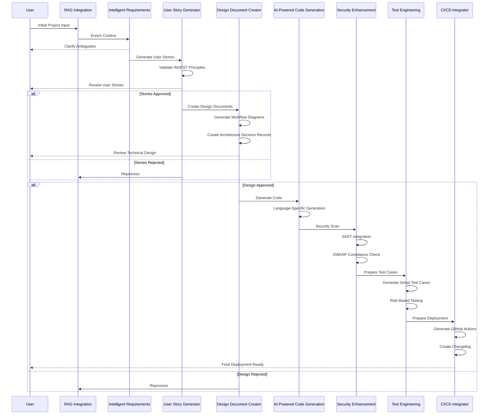

```mermaid
sequenceDiagram
    participant User
    participant RAG as RAG Integration
    participant RequirementsGathering as Intelligent Requirements
    participant UserStoryGen as User Story Generator
    participant DesignDoc as Design Document Creator
    participant CodeGen as AI-Powered Code Generation
    participant SecurityLayer as Security Enhancement
    participant TestSuite as Test Engineering
    participant CICD as CI/CD Integrator

    User->>RAG: Initial Project Input
    RAG->>RequirementsGathering: Enrich Context
    RequirementsGathering-->>User: Clarify Ambiguities
    RequirementsGathering->>UserStoryGen: Generate User Stories
    UserStoryGen->>UserStoryGen: Validate INVEST Principles
    UserStoryGen-->>User: Review User Stories
    
    alt Stories Approved
        UserStoryGen->>DesignDoc: Create Design Documents
        DesignDoc->>DesignDoc: Generate Workflow Diagrams
        DesignDoc->>DesignDoc: Create Architecture Decision Records
        DesignDoc-->>User: Review Technical Design
    else Stories Rejected
        UserStoryGen->>RAG: Reprocess
    end

    alt Design Approved
        DesignDoc->>CodeGen: Generate Code
        CodeGen->>CodeGen: Language-Specific Generation
        CodeGen->>SecurityLayer: Security Scan
        SecurityLayer->>SecurityLayer: SAST Integration
        SecurityLayer->>SecurityLayer: OWASP Compliance Check
        
        SecurityLayer->>TestSuite: Prepare Test Cases
        TestSuite->>TestSuite: Generate Smart Test Cases
        TestSuite->>TestSuite: Risk-Based Testing
        
        TestSuite->>CICD: Prepare Deployment
        CICD->>CICD: Generate GitHub Actions
        CICD->>CICD: Create Changelog
        CICD-->>User: Final Deployment Ready
    else Design Rejected
        DesignDoc->>RAG: Reprocess
    end
```
